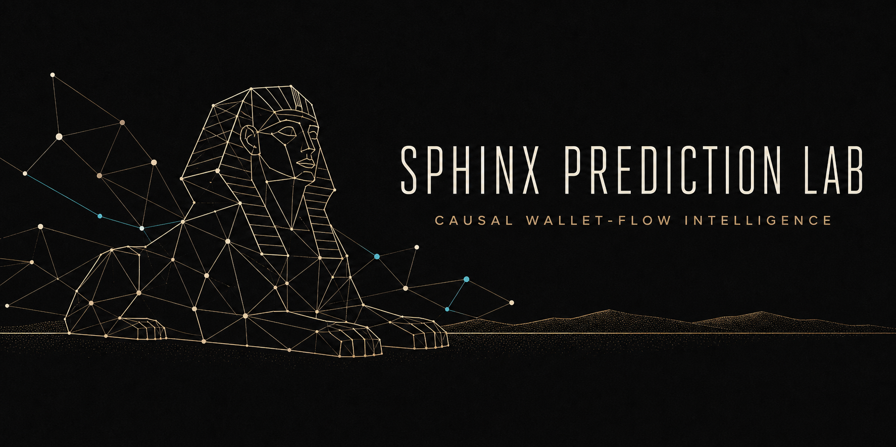
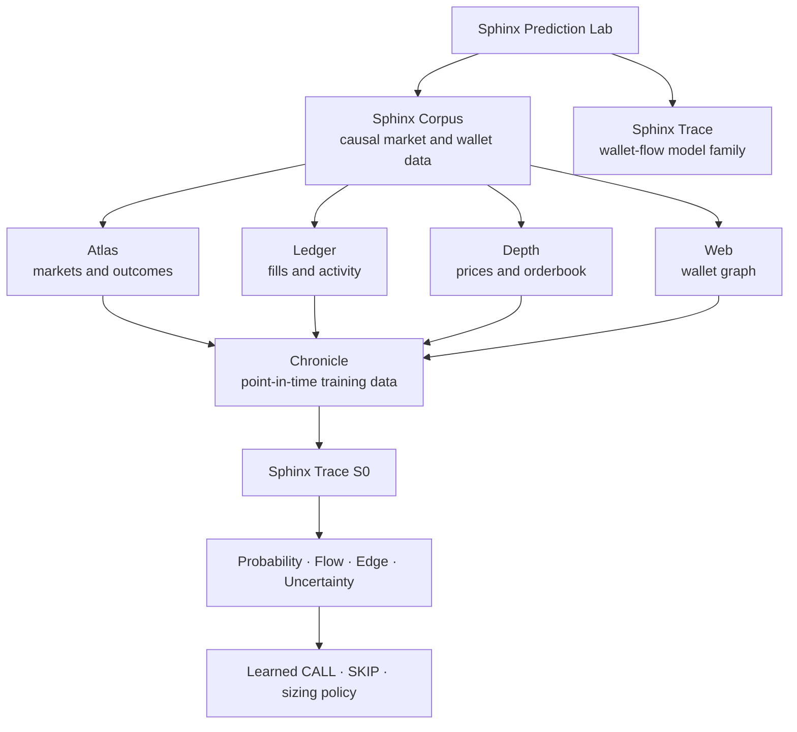
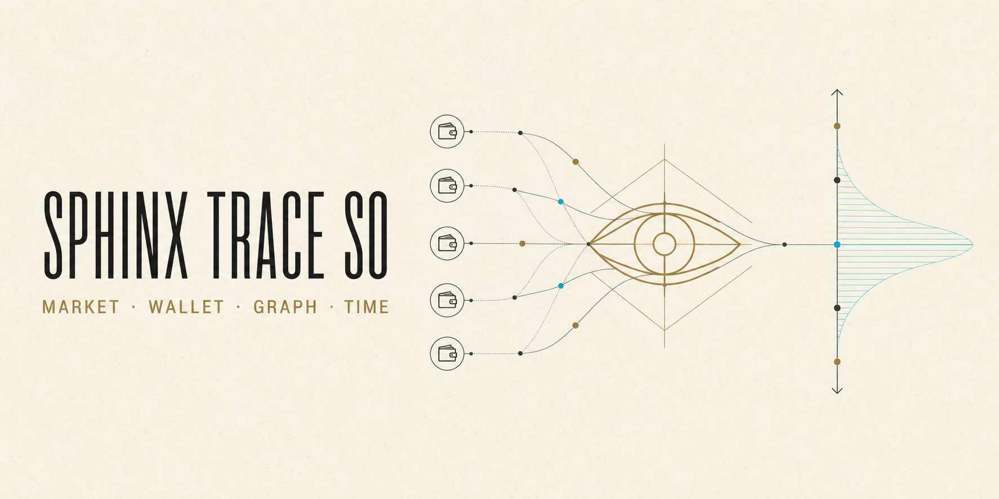

<div align="center">




# Sphinx Prediction Lab

**Causal wallet-flow intelligence for prediction markets**

[](https://www.python.org/)
[](docs/ARCHITECTURE.md)
[](docs/CORPUS.md)
[](#current-status)
[](https://github.com/SergiiRudniev/sphinx-prediction-lab/actions/workflows/ci.yml)
[](LICENSE)

</div>

Sphinx Prediction Lab is a research system for prediction-market intelligence.
It studies market state, participant histories, wallet relationships and causal
capital flow without using news or natural language in the model core.

The first model family, **Sphinx Trace**, is designed to estimate fair outcome
probabilities, detect potentially informed activity and manage positions through
entry, reduction, exit or settlement.

> [!IMPORTANT]
> The repository contains an architecture, data contracts, research protocol and
> one diagnostic S0 checkpoint. It has no accepted trading result.

> [!WARNING]
> This is research software, not financial advice. Automated execution must remain
> disabled until a jurisdiction check, locked paper-forward evaluation and
> deterministic capital controls have passed.

## Research Map



## Model Family

| Family | Specialization | Primary objective | Current state |
| --- | --- | --- | --- |
| **Sphinx Trace** | Wallet-flow prediction-market intelligence | Detect informed activity, estimate fair probabilities and manage positions for maximum net edge | S0 Trial T0 diagnostic |



### Sphinx Trace S0

The H008 S0 direction is a stateful full-universe causal architecture:

1. **Semantic market encoder** — market question, rules, outcomes and structure.
2. **Streaming wallet memory** — every valid participant without a hard wallet cap.
3. **Temporal graph encoder** — wallet, funding, market and event relationships.
4. **Market and event memory** — recurrent state across the complete lifecycle.
5. **Universe memory** — relative capital flow and opportunity across Polymarket.
6. **Prediction and Position Books** — prior beliefs, calls, balance and positions.
7. **Opportunity policy** — terminal outcome, uncertainty, `SKIP` and learned sizing.

The policy learns outcome selection, abstention and balance-conditioned sizing.
The simulator separately enforces physical cash, liquidity, cost and causal-data
constraints.

See [S0 Architecture](docs/ARCHITECTURE.md) and the machine-readable
[`sphinx_trace_research_mandate_v1.json`](configs/trace/sphinx_trace_research_mandate_v1.json).

## Sphinx Corpus

| Dataset | Contract |
| --- | --- |
| **Sphinx Atlas** | Markets, events, outcomes, categories and resolution metadata |
| **Sphinx Ledger** | Executed trades, positions and wallet activity |
| **Sphinx Depth** | Price, spread and historical/live orderbook state |
| **Sphinx Web** | Temporal `wallet ↔ wallet ↔ market` graph |
| **Sphinx Chronicle** | Point-in-time model training dataset |
| **Sphinx Replay** | Stateful backtest and execution episodes |
| **Sphinx Pulse** | Append-only live market and wallet stream |

Raw datasets and credentials are never committed. Every usable snapshot requires
source cursors, hashes, schema versions and a frozen UTC cutoff.

See [Sphinx Corpus](docs/CORPUS.md) and
[`sphinx_chronicle_v1.json`](configs/corpus/sphinx_chronicle_v1.json).

## Causal Research Standard

Sphinx research must preserve:

- features published no later than the decision timestamp;
- wallet reputation computed only from outcomes already resolved at that time;
- chronological, event-grouped splits with target purging;
- validation-only model, threshold and policy selection;
- one-time untouched test opening after source and configuration hashes are locked;
- executable bid/ask, depth, latency, spread, fees and slippage;
- paper-forward evidence before any automated capital allocation;
- complete accounting of accepted, rejected and invalidated hypotheses.

## Current Status

| Item | Status |
| --- | --- |
| Lab and naming | Locked |
| Sphinx Corpus taxonomy | Locked |
| Sphinx Trace S0 contract | Design registered as `SPH-T-H000` |
| Historical backfill | Full `SPH-T-H001` in development; fast S0 `SPH-T-H002` qualified |
| Trial T0 target contract | `SPH-T-H005` qualified; test labels unopened |
| Trial T0 learning preflight | `SPH-T-H006` qualified; resolution signal only; no promotion |
| Wallet-history ablation | `SPH-T-H007` inconclusive on 96 validation events |
| Full-universe research mandate | `SPH-T-H008` registered |
| Full Outcome Chronicle | `SPH-T-H009` registered; resumable build in progress |
| Sphinx Pulse collector | Implemented; passive collection only |
| Trained checkpoint | Diagnostic S0 checkpoint; 50,213,128 parameters |
| Accepted backtest | None |
| Accepted forward result | None |
| Live execution | Disabled |

## Repository Map

```text
.
|-- assets/                 Generated Sphinx brand assets
|-- configs/                Frozen data and model contracts
|-- docs/                   Architecture, corpus and research protocol
|-- schemas/                Point-in-time JSON schemas
|-- deploy/pulse/           Live collector and verified daily publisher
|-- scripts/                Local Corpus backfill and contract entrypoints
|-- src/sphinx_trace/       Runtime contracts and deterministic policy boundary
|-- tests/                  Data-free contract tests
|-- .github/                CI, issue forms and repository governance
`-- pyproject.toml          Python package and development tooling
```

## Development

```bash
git clone https://github.com/SergiiRudniev/sphinx-prediction-lab.git
cd sphinx-prediction-lab

python -m venv .venv
python -m pip install --upgrade pip
python -m pip install -e ".[dev]"

python scripts/check_contracts.py
python -m pytest
ruff check .
mypy src tests scripts
```

Research dependencies are optional:

```bash
python -m pip install -e ".[research,dev]"
```

## Documentation

- [Sphinx Trace S0 Architecture](docs/ARCHITECTURE.md)
- [Sphinx Trace Research Mandate](configs/trace/sphinx_trace_research_mandate_v1.json)
- [Sphinx Corpus](docs/CORPUS.md)
- [Data Sources](docs/DATA_SOURCES.md)
- [Evaluation Protocol](docs/EVALUATION_PROTOCOL.md)
- [Research Journal](docs/RESEARCH.md)
- [Polymarket Edge Bot Review](docs/POLYMARKET_EDGE_BOT_REVIEW.md)
- [Roadmap](docs/ROADMAP.md)
- [Sphinx Pulse Operations](deploy/pulse/README.md)
- [Contributing](CONTRIBUTING.md)
- [Security](SECURITY.md)

## License

Apache License 2.0. See [LICENSE](LICENSE).
