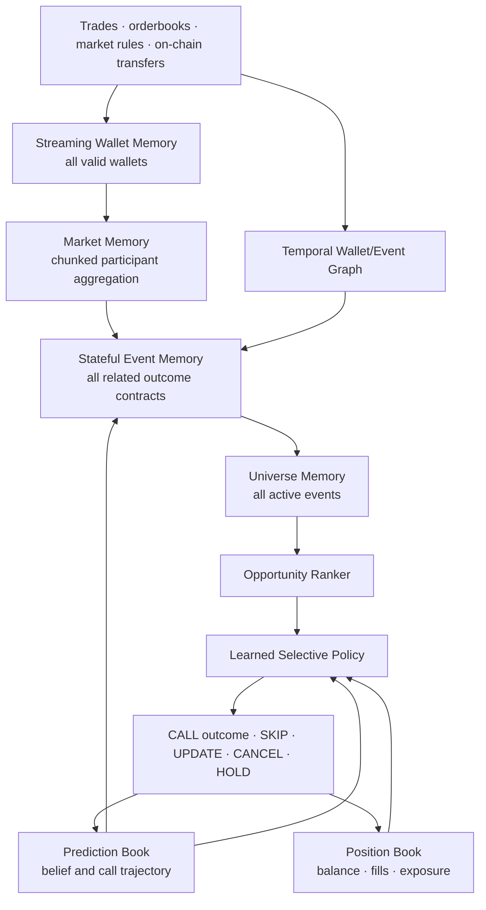

# Sphinx Trace Architecture

**Status:** H008 mandate and H009/H010 data-simulator contracts registered; full model not trained
**Research IDs:** `SPH-T-H000`, superseded in scope by `SPH-T-H008` through `SPH-T-H010`
**Accepted trading evidence:** none

Sphinx Trace selects a Polymarket event, a specific outcome contract and a
position size, or abstains with `SKIP`. Its default position intent is hold to
terminal resolution. Short-horizon price prediction is not the core objective;
current executable price is an input cost used to decide whether a correct
outcome belief is worth buying.

The research objective is maximum net profit after executable costs. Compute,
training time and parameter count are not optimization objectives. Capacity and
ensembles are selected by locked validation and simulator evidence.

## Universe

The model scope includes all Polymarket categories and resolution horizons:

- binary `YES/NO` markets;
- multi-outcome events;
- neg-risk structures;
- related markets and events;
- all valid participant wallets and their causal histories.

Cancelled, ambiguous, invalid or non-replayable markets are excluded because no
sound terminal training or execution target exists. This is data integrity, not
model abstention.

Market question, rules and structured outcome text may enter a semantic encoder.
External news analysis remains outside the model. Point-in-time Polygon funding
and transfer relationships are required; wallet activity from other protocols may
be added when its source time and provenance are reproducible.

## Hierarchy



### Streaming wallet memory

There is no hard participant-count cap. Every valid participant updates a causal
wallet state. A market processes wallet states in chunks against a small latent
market memory, making computation approximately linear in participant count
instead of applying quadratic attention across all wallets.

The wallet state may encode:

- trade direction, size, timing and concentration;
- performance on markets resolved before the current decision;
- specialization and transfer across market structures;
- novelty, funding sources and cluster membership;
- coordinated, follower, market-making and anomalous behavior;
- uncertainty from sparse or dependent history.

New wallets remain visible with explicit novelty and uncertainty. Dust activity
is retained through robust aggregation and manipulation features rather than a
hard activity threshold. Raw wallet IDs are used to build causal state and debug
receipts but are not trainable identity embeddings.

### Market and event memory

Each market state consumes the full causal trade/orderbook stream and the chunked
participant set. Related contracts then update one event memory. A unified event
analysis selects the relevant concrete contract and side; multiple positions in
related events remain possible.

Event memory is recurrent across its complete lifecycle. It combines event-time
updates with minute, hour, day and full-history representations. Lifecycle and
market-structure experts may specialize through a learned router.

### Temporal graph

The graph is heterogeneous and time-versioned:

```text
wallet --traded--> market
wallet --funded-by/transferred-to--> wallet
wallet --co-acted-with/followed--> wallet
market --belongs-to--> event
event --related-to/contradicts--> event
```

Every edge carries event time and provenance. No transfer, resolution or graph
relationship published after the decision may enter a historical state.

### Universe memory and opportunity ranker

All active event states update a bounded set of universe latents in chunks. This
allows a prediction for one event to condition on capital rotation, shared wallet
clusters and competing opportunities across Polymarket without placing all raw
events in one quadratic attention context.

The ranker compares terminal value, uncertainty and executable entry state across
events. It learns cross-sectional opportunity order rather than relying only on
per-event outcome accuracy.

## Prediction and Position Memory

The Prediction Book stores the complete belief trajectory and a compressed event
state:

- first and last observation;
- probability distribution and uncertainty at every update;
- `SKIP`, CALL, update and cancellation history;
- selected contract, side, quoted price and intended size;
- evidence hashes and changes since the prior prediction;
- later resolution and error, only after publication.

Prior model predictions are state, not new market evidence. A recurrent update may
express the next belief as a residual over the previous belief, but new confidence
must be supported by new causal input.

The Position Book is separate. It records the simulator or future execution truth:
orders, fills, cash, open positions and resolutions. Active positions condition
future ranking and sizing. An unexecuted CALL is not repeated without new evidence.

## Outputs and Learned Policy

The model may emit:

| Output | Purpose |
| --- | --- |
| Terminal outcome distribution | Probability for every valid event outcome |
| Epistemic and aleatoric uncertainty | Separate model ignorance from outcome noise |
| Learned data sufficiency | Evidence for selective prediction and `SKIP` |
| Informed-flow/coordination score | Describe anomalous wallet evidence without identity accusations |
| Opportunity rank | Compare the event with the active universe |
| Position fraction | Size from balance, positions, execution state and model belief |
| Action | CALL, `SKIP`, update, cancellation or hold |

`SKIP` and sizing are learned policy decisions rather than fixed analytical
thresholds. The model may revise a CALL, change side or cancel it as evidence
changes. Every prediction change is retained for debugging.

The execution engine still enforces physical truth: it cannot spend unavailable
cash, fill absent orderbook liquidity, use future/stale data or omit configured
fees, latency, slippage and partial fills. Emergency custody and jurisdiction
controls remain outside ML.

## Training Program

Training is staged so that every part can use the full historical corpus:

1. Self-supervised wallet, market, semantic and graph representation learning.
2. Supervised terminal-outcome and uncertainty training.
3. Cross-sectional event opportunity ranking.
4. Stateful selective-policy and sizing training in the offline simulator.
5. Calibration and locked walk-forward evaluation.
6. One-time untouched historical test, followed by paper-forward evidence.

Snapshot generation is adaptive across the full event lifecycle: event-time
updates after relevant activity plus a heartbeat for quiet periods. Training rows
are sequential event episodes, not independent random samples.

Candidate capacities begin at approximately 50M, 100M and 150M parameters.
Ensembles are allowed. The smaller system is selected only when evidence is not
worse, never solely to save compute.

Runs longer than two hours must support graceful pause and exact resume. Atomic
checkpoints occur at least every 15 minutes and include model, optimizer,
scheduler, precision scaler, RNG, sampler/data cursor, simulator, prediction
memory and source/config hashes.

## Debugging Contract

Every prediction must be reproducible from hashed inputs. Debugging retains:

- the causal market, text, wallet, graph, universe and position inputs;
- the full probability/action trajectory;
- top positive, negative and conflicting evidence;
- wallet contribution through counterfactual removal;
- matched passes without wallet, graph, semantic or universe context;
- graph paths and contributing clusters;
- feature attribution and expert/router decisions;
- order, fill, cost and resolution accounting.

Attention weights alone are not accepted as an explanation. Counterfactuals and
replayable input receipts are required.

## Evaluation and Promotion

Primary evaluation is net profit after executable costs in the same full
Polymarket simulator for every model and baseline. Probability, calibration,
selective risk, call frequency, drawdown, bankruptcy, fill rate and event/category
breadth remain required diagnostics.

At minimum, historical promotion requires 1,000 calls across 1,000 independent
events, a positive lower 95% block-bootstrap net-profit bound and improvement over
the strongest registered baseline. The target median frequency is at least three
calls per week, without weakening the wrong-CALL objective to manufacture volume.

Historical test labels remain closed until model, policy, simulator, calibration
and source hashes are frozen. Production remains out of scope until a subsequent
90-day paper-forward run contains at least 100 calls and positive net profit after
all costs.

See the machine-readable
[`sphinx_trace_research_mandate_v1.json`](../configs/trace/sphinx_trace_research_mandate_v1.json)
and [Evaluation Protocol](EVALUATION_PROTOCOL.md).
