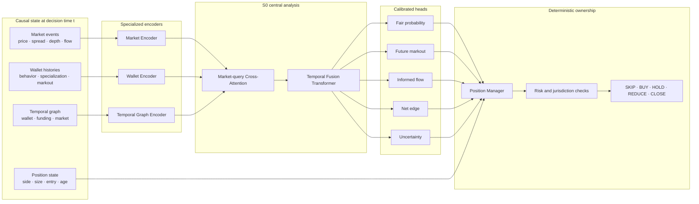

# Sphinx Trace S0 Architecture

**Status:** design
**Research ID:** `SPH-T-H000`
**Accepted performance evidence:** none

Sphinx Trace S0 is the first model in the Sphinx Trace family. It analyzes only
market, transaction, wallet and graph state that was observable at the decision
timestamp. News and natural-language inputs are outside the S0 model core.

## Objective

Estimate executable net edge for prediction-market actions while distinguishing
repeatable wallet information from luck, market making, follower behavior and
already-priced flow.

The model does not label a person as an insider. It estimates whether the current
wallet flow has historically behaved like informed flow, with explicit uncertainty.

## Inference Graph



## Inputs

### Market encoder

Consumes the latest causal market sequence:

- executable bid and ask per outcome;
- spread and depth at configured price bands;
- trade direction, size and markout context;
- open interest and participant concentration;
- time to market close and resolution;
- lifecycle and protocol-version flags.

S0 begins with a causal temporal encoder. Dense all-history attention is not
allowed; the input is an event-time window with explicit age and gap features.

### Wallet encoder

Consumes a wallet's state as it existed at time `t`:

- prior trades and resolved-market performance;
- category specialization;
- entry timing and post-trade markout;
- concentration, turnover and typical size;
- maker/taker behavior where observable;
- uncertainty from limited independent history.

Raw wallet IDs are not trainable embeddings in S0. The encoder must generalize to
new wallets from behavior rather than memorize addresses.

### Temporal graph encoder

Operates on a heterogeneous graph:

```text
wallet --traded--> market
wallet --funded-by--> wallet
wallet --co-acted-with--> wallet
wallet --followed--> wallet
market --belongs-to--> event
```

Edges carry event time, direction, size, price and provenance. Neighborhoods are
strictly time-filtered and capped before attention to avoid quadratic all-wallet
computation.

## Fusion

The market representation is the primary query. It attends to the top causal wallet
and graph tokens selected without future performance. This lets the model answer:

- which participants matter for this market now;
- whether their behavior is independent or coordinated;
- whether the observed flow is already reflected in executable prices;
- whether the pattern transfers across independent resolved markets.

S0's initial target is 5–10 million trainable parameters. Capacity changes require
a registered hypothesis; model size is not itself evidence.

## Output Heads

| Head | Output | Training target |
| --- | --- | --- |
| Fair probability | Calibrated `P(YES)` | Resolved outcome with point-in-time features |
| Markout | 5m, 1h and 1d price movement | Future executable midpoint/bid-ask state |
| Informed flow | Directional flow quality | Subsequent markout and resolved net edge |
| Net edge | Action value after costs | Replayable PnL under executable assumptions |
| Uncertainty | Quantiles and confidence | Residual and ensemble uncertainty |

There is no supervised `insider` label. Public output must use terms such as
`informed-flow score` or `anomalous information advantage`.

## Position Manager

The position manager is deterministic during S0 evaluation. It receives calibrated
model outputs plus current position and executable market state.

Allowed actions:

```text
SKIP
BUY_YES
BUY_NO
HOLD
REDUCE
CLOSE
HOLD_TO_RESOLUTION
```

Hard capital limits, stale-data rejection, slippage limits, kill switches,
jurisdiction checks and key custody remain outside ML.

## S0 Non-Goals

- Natural-language or news analysis.
- Identity attribution or accusations of insider trading.
- Unbounded wallet-ID memorization.
- Live autonomous trading before locked paper-forward evidence.
- Performance claims reconstructed from opened test periods.

## Promotion Boundary

S0 may be called `prospective` only after dataset hashes, checkpoint selection,
calibration, policy and untouched test boundaries are frozen. It may be called
`released` only after the registered gates in
[Evaluation Protocol](EVALUATION_PROTOCOL.md) pass.
