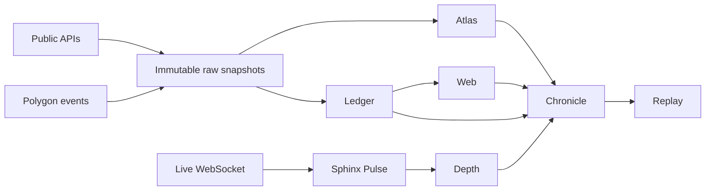

# Sphinx Corpus

Sphinx Corpus is the data system for Sphinx Prediction Lab. It separates immutable
source evidence from derived point-in-time features and evaluation episodes.

## Dataset Map

| Dataset | Ownership |
| --- | --- |
| **Sphinx Atlas** | Market, event, token, outcome and resolution metadata |
| **Sphinx Ledger** | Executed trades, positions and wallet activity |
| **Sphinx Depth** | Price history, spread and collected orderbook state |
| **Sphinx Web** | Time-indexed wallet, funding and market relationships |
| **Sphinx Chronicle** | Model-ready point-in-time rows and labels |
| **Sphinx Replay** | Stateful execution episodes and fills |
| **Sphinx Pulse** | Append-only live WebSocket and chain ingestion |

## Data Flow



## Point-in-Time Contract

For every decision timestamp `t`:

1. Every feature must have `published_at <= t`.
2. Wallet performance may use only markets resolved before `t`.
3. Graph edges must have occurred before `t`.
4. Resolution and markout labels are joined only after features are frozen.
5. Rows with uncertain publication time are excluded from causal evaluation.
6. Splits are chronological and grouped by event, never random by trade row.

Current positions and leaderboard aggregates cannot be backfilled as historical
features unless their state at `t` is reconstructed from underlying events.

## Required Manifest

Every snapshot must declare:

```text
dataset_id
schema_version
source endpoints and contract addresses
source cursors or block range
minimum and maximum event time
collection time
row count
content hashes
protocol version
known gaps
license and redistribution constraints
```

## Storage

- Raw responses: compressed immutable objects, partitioned by source and date.
- Normalized facts: Parquet with UTC timestamps and explicit source provenance.
- Graph edges: Parquet edge tables plus point-in-time neighborhood indices.
- Training rows: frozen Sphinx Chronicle snapshots.
- Large data and credentials: never committed to Git history. Pulse archives use
  checksum-verified GitHub Release assets.

## Historical Limits

Executed trades, resolution and on-chain activity can be backfilled. Complete
historical off-chain order placement, cancellation and L2 depth generally cannot be
reconstructed. Sphinx Depth therefore distinguishes:

- `historical_price`: backfilled price observations;
- `collected_l2`: full snapshots collected by Sphinx Pulse;
- `synthetic_depth`: prohibited for accepted execution evidence.

## Corpus v1 Backfill

`SPH-T-H001` registers the first historical window as
`[2025-07-16T00:00:00Z, 2026-07-16T00:00:00Z)`.

- Atlas collects both open and closed Gamma market partitions and then keeps
  markets whose lifecycle intersects the registered window.
- Ledger uses public Data API trades with explicit `start` and `end` bounds.
  Markets are batched into bounded request groups. A full page at the maximum
  offset causes the group time interval to split until no pagination saturation
  remains.
- Polygon `OrderFilled` is a verification source. A registered density probe
  estimated roughly 1.45 billion technical fills for the year, so duplicating
  the full chain event stream is not the primary training corpus.
- Depth is collected separately because hourly historical prices and live L2
  observations have different causal and execution meaning.

Historical backfill is a local batch workload stored beside the training
machine. Ubuntu is reserved for the continuous Sphinx Pulse collector.

### S0 Fast Ledger

`SPH-T-H002` is a separate training-first view of the same one-year window. It
keeps public trades with at least 25 USD cash notional and runs concurrent request
groups below the documented Data API limit. A registered pilot retained 93.7
percent of cash notional while reducing row count by 74.7 percent. The fast and
unfiltered Ledgers use separate storage namespaces and must not be presented as
the same snapshot.

The local runner defaults to the fast profile:

```powershell
scripts\run_corpus_backfill.ps1 -DataDir "E:\Sphinx Corpus" -Phase atlas-ledger
```

Pass `-Profile full` only when continuing the unfiltered `SPH-T-H001` Ledger.

## Versioning

Datasets and models version independently:

```text
Model: Sphinx Trace S0
Training data: Sphinx Chronicle v1.0
Graph data: Sphinx Web v1.0
Execution data: Sphinx Replay v1.0
Snapshot cutoff: YYYY-MM-DDTHH:MM:SSZ
```

Schema changes require a major dataset version when they alter row meaning,
causal availability or label construction.

## Pulse Operations

Sphinx Pulse records the public Polymarket market channel without feeding the
current model. It writes append-only zstd JSONL shards by UTC date and hour.
Completed UTC days are published as GitHub Releases with a manifest, row counts,
source endpoints and SHA-256 hashes. Local shards are removed only after every
remote asset and the manifest pass size and digest verification.

See [Pulse operations](../deploy/pulse/README.md).
